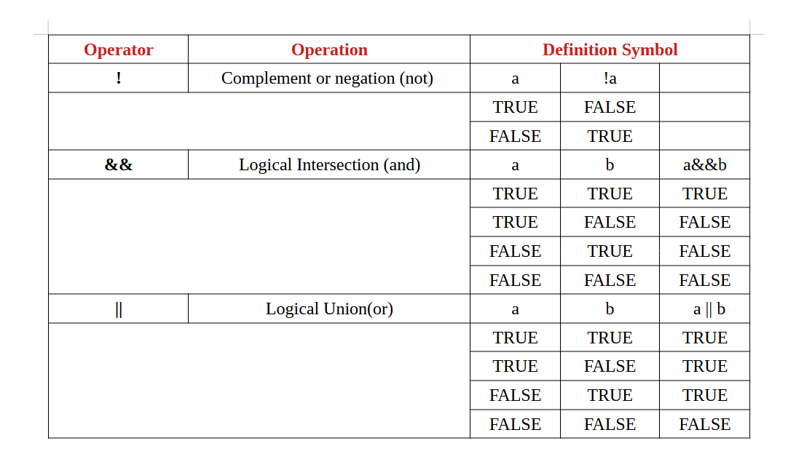

<head>
<!--Google Icon-->
  <link rel="stylesheet" href="https://fonts.googleapis.com/icon?family=Material+Icons">

  <!--MathJax-->
  <script src="https://polyfill.io/v3/polyfill.min.js?features=es6"></script>
  <script id="MathJax-script" async src="https://cdn.jsdelivr.net/npm/mathjax@3/es5/tex-mml-chtml.js"></script>
</head>

[
](https://baponkar.github.io/Learning-C)


# 8. Conditional Statements

How does a algorithm of a program perform or executed may be follow some logical expression.As example No sunlight at night.First we ask is it night or not? here answer is yes, no or don't know.Then we can conclude either there will present sunlight or not.
We can compare two numbers or finding some character in a string etc by logical expression.The Relational Operators are

| Operator | Meaning                  |
|----------|--------------------------|
| ==       | Equal to                 |
| >        | Greater than             |
| <        | Less than                |
| >=       | Greater than or equal to |
| <=       | Less than or equal to    |
| !=       | Not equal to             |

We can use conditional statements by 


```c
    if(logical expression){
        do something;
    }else{
        do something else;
    }
```


Example : Find a bigger number in between two number

```c
#include<stdio.h>

int main(){
    int a = 5;
    int b = 8;

    if(a > b){
        printf("a is greater than b");
    }else{
        printf("a is less than b");
    }
}
```

For complex type condition we also use `else if` statements in conditional statements we can use this type statements by the following

```c
    if(logical expression){
        do something;
    }else if{
        do something else;
    }else if{//We can add as many as else if satements
        do something else;
    }else{

    }
```

* The people are called 1-12 years as child, 12-18 years teen and 18-40 years  young and above 40 is called old age. Now write a program by using logical expression to check your category.

```c
#include<stdio.h>

int main(){
    int age = 23;

    if(age >= 1 && age <=12){ //&& represents and operator
    //Here age>=1 && age <= 12 say the age between  1 to 12 i.e. age must be above or equal to one and age less than or equal 12 years both condition satisfied
        printf("You are a child.");
    }else if(age>12 && age <=18){
        printf("You are a teen.");
    }else if(age > 18 && age<= 40 >){
        printf("You are a young");
    }else{
        printf("You are a old."); //for all other cases i.e. above 40 years
    }
}
```

## Logical Operators and Expressions



We also use logical expression in ' for ' and ' while ' loop 
See details in chapter [Loops](https://baponkar.github.io/Learning-C/Loops/Loops)
* Write a C program which find the biggest and smallest number among 35, 78,45, 203, 2, 11, 56, 13, 91, 10.

```c
#include<stdio.h>

int main(){
    int max = 0;
    int min = 0;
    int data[10] = {35, 78, 45, 203, 2, 11, 56, 13, 91, 10}; //assigning the giving numbers into an integer array

    for(int i=0; i <10; i++){
        if(max < data[i]){
            max = data[i]; //get biggest number
        }
    }

    //initialise the min with first item 
    min = data[0];

    for(int i=0; i <10; i++){
        if(min > data[i]){
            min = data[i]; //get biggest number
        }
    }

    printf("Min = %d, Max = %d", min, max);

    return 0;
}
```

We know every string is array of character and last character is '\0' .Write a function to find the length of a string by logic to find the end of the string character .

```c
#include<stdio.h>

int main(){

    char my_string[] = "Hello World!";

    int i = 0;
    while(my_string[i] != '\0'){
        i++;
    }

    printf("Length of the string %d", i);

    return 0;
}
```

We can check above result by standard string.h headerfile

```c
#include<stdio.h>
#include<string.h>

int main(){
    char my_string[] = "Hello World!";

    int length = strlen(my_string);

     printf("Length of the string %d", length);//Output : Length of the string 12
    return 0;
}
```

* Switch statement

```c
switch(expression){
    case constant_1:
        s_11;
        s_12;
        .
        .
        break;
    case constant_2:
        s_21;
        s_22;
        .
        .
        break;
    ......
    case constant_n:
        s_n1;
        s_n2;
        .
        .
        break;
    case default:
        s_d1;
        s_d2;
        .
        .
        break;
}

```

* Solve $ax^2+bx+c = 0$ .

```c
#include<stdio.h>
#include<math.h>

int main(){
    int a,b,c;
    float x1, x2;
    printf("Enter the values of a, b, c with space\n");
    scanf("%d %d %d", &a, &b, &c);
    
    float z = b*b - 4*a*c;

    if(z > 0){//When z is positive
        //Roots are real
        x1 = (-b + sqrt(z))/(2*a);
        x2 = (-b - sqrt(z))/(2*a);
        printf("The solution : x1 = %f, x2 = %f\n", x1, x2);

    }else if(z < 0){ //when z is negative
        //roots are complex
        float real = -b/a;
        float comp = sqrt(-z);
        printf("The solution: x1 = %f + %fi, x2 = %f - %fi\n", real,comp, real, -comp);

    }else{ //When z==0
        //both roots are equal and real
        x1 = -b/a;
        x2 = -b/a;
        printf("The solution: x1 = %f, x2 = %f\n", x1, x2);
        printf("Where i = sqrt(-1)\n");
    }


    return 0;
}

```

## Output

```bash
Enter the values of a, b, c with space
5 7 8
The solution: x1 = -1.000000 + 10.535654i, x2 = -1.000000 - -10.535654i
Where i = sqrt(-1)
```


<div style="text-align: center;">
    <button type="button" onclick="window.location.href='https://baponkar.github.io/Learning-C/Input-and-Output/Input-and-Output';" style="background-color: #4CAF50; color: white; padding: 10px 20px; border: none; border-radius: 5px; cursor: pointer;">
       Prev
    </button>
     <button type="button" onclick="window.location.href='https://baponkar.github.io/Learning-C/Loops/Loops';" style="background-color: #4CAF50; color: white; padding: 10px 20px; border: none; border-radius: 5px; cursor: pointer;">
       Next
    </button>
</div>


<hr>
<div style="text-align: center;">
    © 2024 Bapon Kar. All rights reserved.
</div>
<hr>