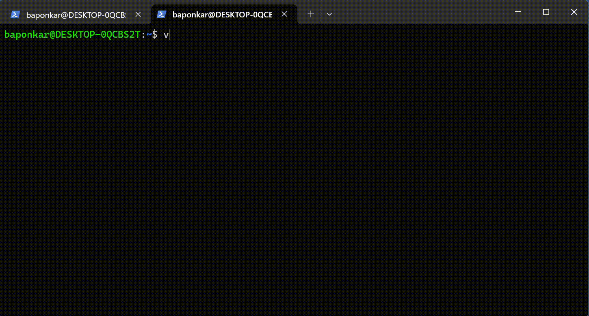

[
](https://baponkar.github.io/Learning-C)

# 3. Hello World programe



The simple and first programe it will print `Hello World!` . The file save with `hello.c` .
[Download Code](./code/hello.c)

```c
#include<stdio.h>

int main(){
    printf("Hello World!");

    return 0;
}
```
Here `#include<stdio.h>` is standard input output header file for printing in the terminal as output.
In C each line is ended with semicolon `;`.Here main() function return 0 which means the programe executed successfully. The main() is enclosed with `{` and `}`.

Generating Binary file by gcc by `gcc hello.c -o hello_world.bin` which generate a new  binary file `hello_world.bin` and run the binary file by `./hello.bin`


```bash
user@computer:~$ gcc hello_world.c -o hello_world.bin
user@computer:~$ ./hello_world.bin
user@computer:~$ Hello World!
user@computer:~$
```

-----------------------------------------------------------------------


How do yo print "Humanity is above all"?

Choose correct answer

<form id="quizForm">
  <input type="radio" id="option1" name="option" value="answer1">
  <label for="paris">print("Humanity is above all")</label><br>
  <input type="radio" id="option2" name="option" value="answer2">
  <label for="london">printf("Humanity is above all");</label><br>
  <input type="radio" id="option3" name="option" value="answer3">
  <label for="berlin">print("Humanity is above all");</label><br><br>
  <input type="button" onclick="checkAnswer()" value="Check Answer">
</form>

<p id="result"></p>

<script>
function checkAnswer() {
    var radios = document.getElementsByName('option');
    var answer;
    for (var i = 0, length = radios.length; i < length; i++) {
        if (radios[i].checked) {
            answer = radios[i].value;
            break;
        }
    }

    var resultText;
    if (answer === "answer2") {
        resultText = "Correct!";
    } else {
        resultText = "Incorrect. The correct answer is Paris.";
    }
    
    document.getElementById("result").innerText = resultText;
}
</script>


<div style="text-align: center;">
    <button type="button" onclick="window.location.href='https://baponkar.github.io/Learning-C/Gcc/Gcc';" style="background-color: #4CAF50; color: white; padding: 10px 20px; border: none; border-radius: 5px; cursor: pointer;">
       Prev
    </button>
     <button type="button" onclick="window.location.href='https://baponkar.github.io/Learning-C/Numeric-Constants-and-Variables/Numeric-Constants-and-Variables';" style="background-color: #4CAF50; color: white; padding: 10px 20px; border: none; border-radius: 5px; cursor: pointer;">
       Next
    </button>
</div>


