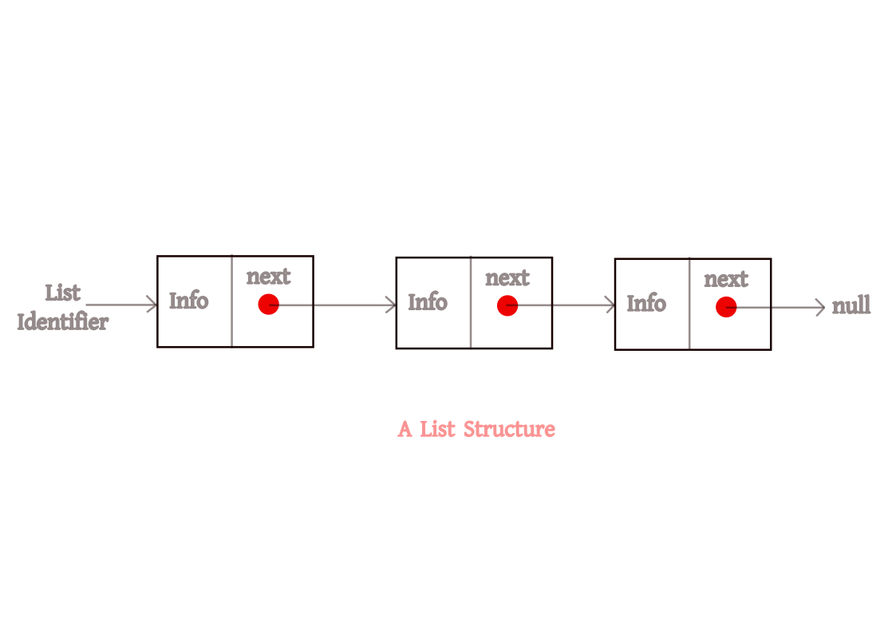
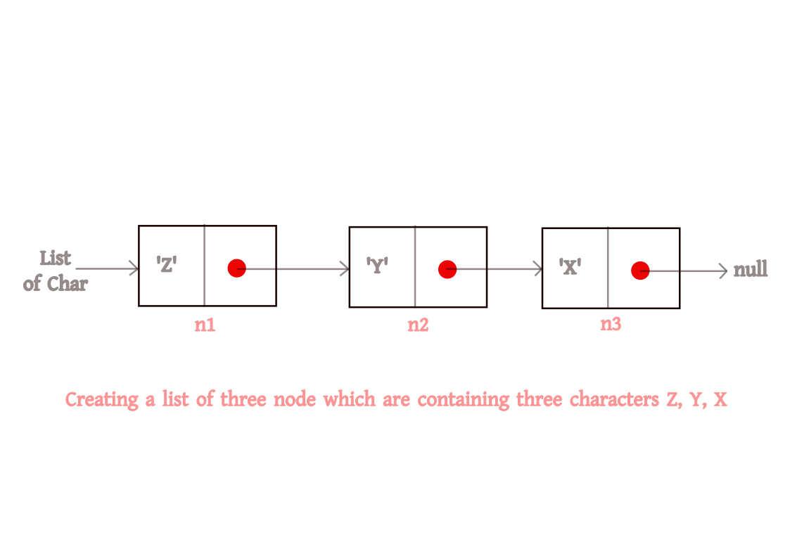

[
](https://baponkar.github.io/Learning-C)

# 17. Lists and Trees







```c

#include<stdio.h>

typedef struct node{
    char info;
    struct node *next_node;
} List_node;


int main(){
    List_node *list_of_char, n1, n2, n3;


    n3.info = 'X';//set content of third node
    n3.next_node = NULL; //link third node to next node

    n2.info = 'Y';//set content of second node
    n2.next_node = &n3;//link second node to next node

    n1.info = 'Z';//set content of first node
    n1.next_node = &n2;//link first node to next node

    list_of_char = &n1; //set the address of list


    //printing
    printf("node3 = %c %x\n", n3.info, n3.next_node);
    printf("node3 = %c %x\n", n2.info, n2.next_node);
    printf("node3 = %c %x\n", n1.info, n1.next_node);
    
    printf("Header address = %x", list_of_char);
     
    /*Output:
    node3 = X 0
    node3 = Y 10d12610
    node3 = Z 10d12620
    Header address = 10d12630
    */
    


    return 0;
}
```


<div style="text-align: center;">
    <button type="button" onclick="window.location.href='https://baponkar.github.io/Learning-C/Pointer-Data-Type-and-its-Application/Pointer-Data-Type-and-its-Application';" style="background-color: #4CAF50; color: white; padding: 10px 20px; border: none; border-radius: 5px; cursor: pointer;">
       Prev
    </button>
     <button type="button" onclick="window.location.href='https://baponkar.github.io/Learning-C/Recursion/Recursion';" style="background-color: #4CAF50; color: white; padding: 10px 20px; border: none; border-radius: 5px; cursor: pointer;">
       Next
    </button>
</div>


<hr>
<div style="text-align: center;">
    © 2024 Bapon Kar. All rights reserved.
</div>
<hr>