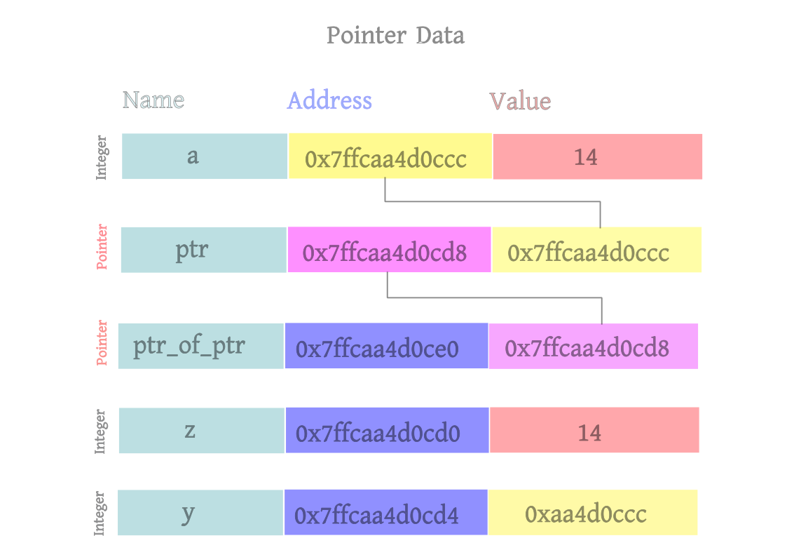

# Pointer Data Type and its Application
------------------------------------------------------------------------

### Understanding Pointers in C


Pointers are a fundamental aspect of the C programming language, offering powerful capabilities for memory management, efficiency, and flexibility. They are variables that store memory addresses, enabling direct interaction with memory and the manipulation of data in ways that other variables do not permit. This article delves into the intricacies of pointers, their usage, and their importance in C programming.

#### What is a Pointer?

A pointer is a variable that holds the address of another variable. Instead of storing a direct value, a pointer stores the memory location where the value resides. This capability allows for dynamic memory allocation, efficient array and string manipulation, and the creation of complex data structures like linked lists and trees.

#### Declaration and Initialization

To declare a pointer, you specify the type of data it points to, followed by an asterisk (*) and the pointer's name. For example:

```c
int *ptr;
```

This declaration means `ptr` is a pointer to an integer. Before using a pointer, it should be initialized to point to a valid memory address. Initialization can be done using the address-of operator (`&`):

```c
int value = 42;
int *ptr = &value;
```

Here, `ptr` is assigned the address of the variable `value`.

#### Dereferencing Pointers

Dereferencing a pointer means accessing or modifying the value stored at the memory address the pointer holds. The asterisk (*) is used again, this time to dereference the pointer:

```c
int value = 42;
int *ptr = &value;
printf("Value: %d\n", *ptr); // Output: Value: 42
*ptr = 10;
printf("Value: %d\n", value); // Output: Value: 10
```

By dereferencing `ptr`, we can read and modify the value of `value`.

#### Pointer Arithmetic

Pointers support arithmetic operations, which are particularly useful when working with arrays. Adding or subtracting integers from pointers moves the pointer by multiples of the size of the data type it points to:

```c
int arr[5] = {1, 2, 3, 4, 5};
int *ptr = arr; // Points to the first element
printf("%d\n", *(ptr + 2)); // Output: 3
```

In this example, `ptr + 2` points to the third element of the array `arr`.

#### Pointers and Arrays

Pointers and arrays are closely related in C. The name of an array is essentially a constant pointer to its first element. Therefore, array elements can be accessed using pointers:

```c
int arr[5] = {1, 2, 3, 4, 5};
int *ptr = arr;
for(int i = 0; i < 5; i++) {
    printf("%d ", *(ptr + i)); // Output: 1 2 3 4 5
}
```

#### Dynamic Memory Allocation

One of the most powerful features of pointers is their role in dynamic memory allocation, enabling programs to request memory from the heap at runtime. This is achieved using functions like `malloc`, `calloc`, `realloc`, and `free`:

```c
int *ptr = (int *)malloc(5 * sizeof(int)); // Allocates memory for 5 integers
if (ptr == NULL) {
    printf("Memory allocation failed\n");
    return 1;
}
for (int i = 0; i < 5; i++) {
    ptr[i] = i + 1;
}
free(ptr); // Deallocates the memory
```

In this example, `malloc` allocates memory for five integers, and `free` releases the allocated memory.

#### Pointers to Pointers

C allows the creation of pointers to pointers, enabling the handling of multi-level indirection. This is particularly useful for dynamic multi-dimensional arrays and complex data structures:

```c
int value = 42;
int *ptr = &value;
int **ptr_to_ptr = &ptr;
printf("Value: %d\n", **ptr_to_ptr); // Output: Value: 42
```

Here, `ptr_to_ptr` is a pointer to the pointer `ptr`, which in turn points to `value`.

#### Function Pointers

Pointers can also point to functions, allowing for dynamic function calls and the creation of callback functions:

```c
void printHello() {
    printf("Hello, World!\n");
}
void (*funcPtr)() = printHello;
funcPtr(); // Output: Hello, World!
```

In this example, `funcPtr` is a pointer to the function `printHello`, which is then called using the pointer.

#### Conclusion

Pointers are an essential feature of the C programming language, providing the ability to manipulate memory directly and efficiently. Understanding pointers is crucial for mastering C and developing robust and high-performance applications. From simple variable referencing to complex data structures and dynamic memory management, pointers unlock the full potential of C programming.

----------------------------------------------------------------------------------------------




```(c)

#include<stdio.h>


int main(){

	char c = 'm';
	printf("The address of m is %p and its value is %c\n", &c, c);
	//The address of m is 0x7ffecf06e1ff and its value is m

	//-----------------------------------------------------------------------------------
	
	int a = 32; //The compiler automatically assign a free address for integer variable a
		    //and set its value 32
	printf("The address of integer variable a is %p and its value is %d\n", &a, a);
	//The address of integer variable a is 0x7ffecf06e200 and its value is 32
	//The address is changing in everytime
	
	int b = &a;
	printf("The address of integer variable b is %p and its value is %p\n", &b, b);
	//The address of integer variable b is 0x7ffecf06e204 and its value is 0xcf06e200

	
	// int a = 32 ==> int *x ==> int y
	// a = 32
	// *x = &a assigning pointer value of address a
	// y = *x assigining the value of a into y 
	
	
	//Introducing Pointer Data Type
	int *x;
	
	x = &a;	//Initially The compiler assign a free address to x
		//Here The content of x is set to 32 which is content of a. But there
		//is no connection x to a.
		//During integer variable x initialization start to set equal to content of b
		// but b content is address of a so then try to find the content of a
		//The content of a is a pure integer value 32
		//So ultimately set the value of x is 32. 
	
	printf("The address of x is %p and the value is %p\n", &x, x);
	
	int y = *x;
	printf("The address of y is %p and the value is %d\n", &y, y);

	//------------------------------------------------------------------------------------

	// Pointers And Arrays
	int arr[5] = {8, 6, 5, 9, 11};
	
	printf("The address of first item of the array is %p and the content is %d\n", &arr[0],arr[0]);
	//The address of first item of the array is 0x7ffe179fb2e0 and the content is 8

	int *temp = arr;
	printf("The address of temp is %p and content is %d\n", &temp, temp); 
	//The address of temp is 0x7fffd225b2a8 and content is -769281360b	


	
	*temp = &arr[0];
	printf("The address of temp is %p and content is %d\n", &temp, temp);
	//The address of temp is 0x7fffd225b2a8 and content is -769281360b

	printf("The Second item %d\n", temp+1);

	int temp1 = *temp;
	printf("The value of temp1 is %d\n", temp1);
}	
```

# Output :
```(bash)
user@:Dell /mnt/b/Programms/C/build$ ./pointer_data_type.bin
The address of m is 0x7fff4ffdba8f and its value is m
The address of integer variable a is 0x7fff4ffdba90 and its value is 32
The address of integer variable b is 0x7fff4ffdba94 and its value is 0x4ffdba90
The address of x is 0x7fff4ffdbaa0 and the value is 0x7fff4ffdba90
The address of y is 0x7fff4ffdba98 and the value is 32
The address of first item of the array is 0x7fff4ffdbab0 and the content is 8
The address of temp is 0x7fff4ffdbaa8 and content is 1342028464
The address of temp is 0x7fff4ffdbaa8 and content is 1342028464
The Second item 1342028468
The value of temp1 is 1342028464
```


<div style="text-align: center;">
    <button type="button" onclick="window.location.href='https://baponkar.github.io/Learning-C/';" style="background-color: #4CAF50; color: white; padding: 10px 20px; border: none; border-radius: 5px; cursor: pointer;">
       Prev
    </button>
     <button type="button" onclick="window.location.href='https://baponkar.github.io/Learning-C/Lists-and-Trees/Lists-and-Trees';" style="background-color: #4CAF50; color: white; padding: 10px 20px; border: none; border-radius: 5px; cursor: pointer;">
       Next
    </button>
</div>