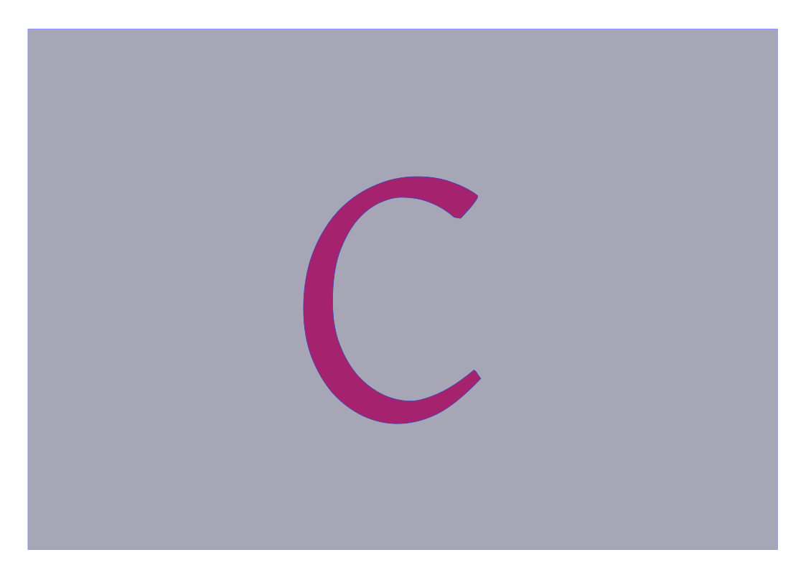

# Learning Programming in C

  
The article is under progress...

Still C is  a relevant programming language in computer science. All Operating system, application software and many scientific computational program is written in C. C is fast and low level supporting language so it is popular among the developer.In this repository I have tried to cover all necessary things in details .

Online C Compiler [programiz.com](https://www.programiz.com/c-programming/online-compiler/)

### Chapters 

1. [Introduction](./Introduction/Introduction)
2. [Compiler](./Gcc/Gcc)
3. [Hello World](./Hello-World/Hello-World)
4. [Numeric Constants and Variables](./Numeric-Constants-and-Variables/Numeric-Constants-and-Variables)
5. [Comments](./Comments/Comments)
6. [Arithmetic Expression](./Arithmetic-Expression/Arithmetic-Expression)
7. [Input and Output](./Input-and-Output/Input-and-Output)
8. [Conditional Statements](./Conditional-Statements/Conditional-Statements)
9. [Loops](./Loops/Loops)
10. [Arrays](./Arrays/Arrays)
11. [Logical Expression](./Logical-Expression/Logical-Expression)
12. [Functions](./Functions/Functions)
13. [Character and Strings](./Character-and-Strings/Character-and-Strings)
14. [Enumerated Data Type and Stacks](./Enumerated-Data-Type-and-Stacks/Enumerated-Data-Type-and-Stacks)
15. [Structure](./Structure/Structure)
16. [Pointer Data type and its Application](./Pointer-Data-Type-and-its-Application/Pointer-Data-Type-and-its-Application)
17. [Lists and Trees](./Lists-and-Trees/Lists-and-Trees)
18. [Recursion](./Recursion/Recursion)
19. [Bit Level Operations and Applications](./Bit-Level-Operations-and-Applications/Bit-Level-Operations-and-Applications)
20. [Files in C](./Files-in-C/Files-in-C)
21. [Miscellaneous Features of C](./Miscellaneous-Features-of-C/Miscellaneous-Features-of-C)

#### Source [code](https://github.com/baponkar/Learning-C/tree/main/src) of some C Programs.

     <button type="button" onclick="window.location.href='https://baponkar.github.io/Learning-C/Introduction/Introduction';" style="background-color: #4CAF50; color: white; padding: 10px 20px; border: none; border-radius: 5px; cursor: pointer;">
       Next
    </button>

    © 2024 Bapon Kar. All rights reserved.

<!--input type="text" name="name" />

Do you agree to the terms?
<input type="checkbox" name="terms" />

Choose your favorite color:
<input type="radio" name="color" value="red" /> Red
<input type="radio" name="color" value="green" /> Green
<input type="radio" name="color" value="blue" /> Blue

<input type="submit" value="Submit" />

<form>
  <label for="name">Name:</label>
  <input type="text" id="name" name="name">  
  <label for="email">Email:</label>
  <input type="email" id="email" name="email">  
  <input type="submit" value="Submit">
</form>

### What is the capital of France?

<form id="quizForm">
  <input type="radio" id="paris" name="capital" value="Paris">
  <label for="paris">Paris</label> 
  <input type="radio" id="london" name="capital" value="London">
  <label for="london">London</label> 
  <input type="radio" id="berlin" name="capital" value="Berlin">
  <label for="berlin">Berlin</label>  
  <input type="button" onclick="checkAnswer()" value="Check Answer">
</form>

<script>
function checkAnswer() {
    var radios = document.getElementsByName('capital');
    var answer;
    for (var i = 0, length = radios.length; i < length; i++) {
        if (radios[i].checked) {
            answer = radios[i].value;
            break;
        }
    }

    var resultText;
    if (answer === "Paris") {
        resultText = "Correct!";
    } else {
        resultText = "Incorrect. The correct answer is Paris.";
    }
    
    document.getElementById("result").innerText = resultText;
}
</script-->

